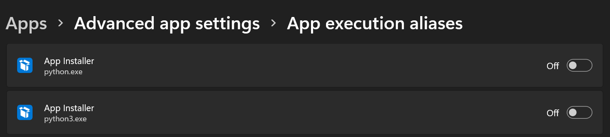
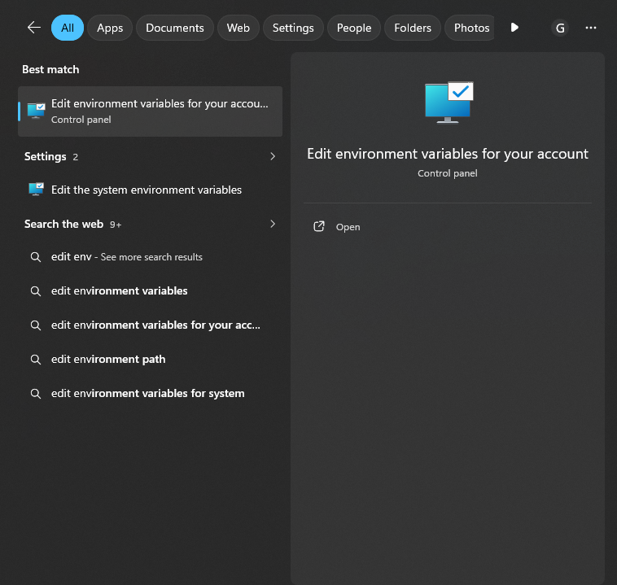
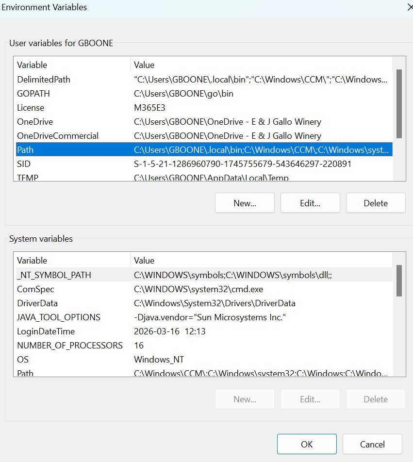
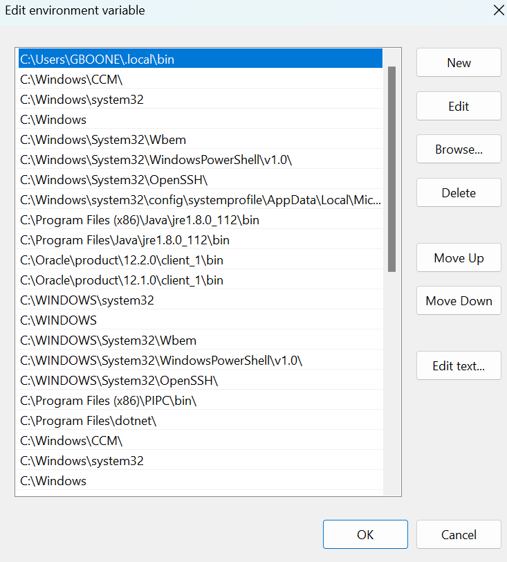
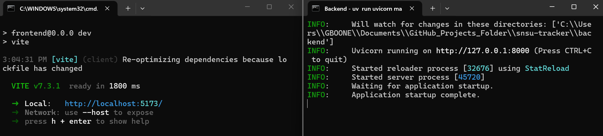

# Start Up Instructions

## Opening Note
This is a locally hosted demo of the snsu tracker app. Follow the instructions in this doc to start up the dev servers and run the demo.

## 1. Installing Python

This project requires Python 3.10 or greater

In the terminal, run the following command to determine if Python is installed. 

```
python --version
```

If Python is installed, it will return the version number for the installed Python interpreter.


```
C:\\Path\to\Project>python --version
Python 3.13.11
```

If you have python 3.10 or greater, you can skip to Step 2

If Python is not installed, the console will error, saying python is not recognized

```
'python' is not recognized as an internal or external command,
operable program or batch file.
```

To install python, go to [https://www.python.org/downloads/](https://www.python.org/downloads/) and click Download Python Install Manager. 

Once installed, restart VS Code and run the below command to ensure python was installed successfully
```
python --version
```

If python still cannot be found, run ```where python``` and confirm the first path shown matches your python installation.

If you path is ```C:\Users\YOUR_USER\AppData\Local\Microsoft\WindowsApps\python.exe```, open your settings and navigate to Apps > Advanced app setting > App execution aliases and deactivate python.exe and python3.exe.


## 2. Installing uv

uv is the package manager and virtual environment manager used by this project

Check if uv is installed on your machine.

```
uv --version
```

If uv is installed, continue to Step 3

To install uv, go to [https://docs.astral.sh/uv/getting-started/installation/](https://docs.astral.sh/uv/getting-started/installation/) and follow installation instructions. 

For Gallo use, the PyPi method is recommended.
```
pipx install uv
```
or
```
pip install uv
```

Once installed, restart VS Code and run the below command to ensure uv was installed successfully
```
uv --version
```
## 3. Install Node.js

Check if uv is installed on your machine.

```
node --version
```

If node is installed, continue to Step 4

To install node, go to [https://nodejs.org/en/download](https://nodejs.org/en/download) and download Standalone Binary(.zip).

Once the binary is downloaded, extract the folder to ```C:\Users\YOUR_USER\node```.

Once extracted, in the search field on the Taskbar on the bottom of the screen, search for "edit environment variables for your account" and select it. 



A new window will open up. Select "Path" from "user variables". Select Edit.



A new window will appear. Select "New" and "Browse". Browse to ```C:\Users\YOUR_USER\node```. Select "Ok" on all windows. 



Once complete, restart VS Code and run the below command to ensure node was installed successfully
```
node --version
```

## 4. Running Application
I've tried to make this step as low friction as possible. In the VS Code terminal, ensure you are in the root of the project (highest level folder) and run the ```start-dev.bat``` batch script. your run the script as follows.

```
start-dev.bat
```

If successful, the script should output
```
============================================
 SNSU Tracker - Development Server Startup
============================================

Installing backend dependencies...
Resolved 20 packages in 2ms
Audited 18 packages in 5ms
Installing frontend dependencies...
node_modules found, verifying...

up to date, audited 292 packages in 3s

54 packages are looking for funding
  run `npm fund` for details

found 0 vulnerabilities

Starting servers...

Backend:  http://127.0.0.1:8000
Frontend: http://localhost:5173/
Press any key to close...
```


Two terminals should open up, one represents the frontend and one the backend.



Click on the blue link in the frontend terminal (http://localhost:5173/) to open the app in your browser.

## 5. Closing the app

Follow the following steps to close the app properly.

1. On the frontend terminal, ```Q + Enter``` will stop the process.
2. On the backend termina, ```Ctrl + C``` will stop the process.
3. Close the frontend and backend terminal windows.
4. Close the browser tab.

## Closing Notes

Congratulations! The app demo is now working!

Remember, the app only works when the frontend and backend terminals are open. http://localhost:5173/ will be blank if the ```start-dev.bat``` script was not run first.